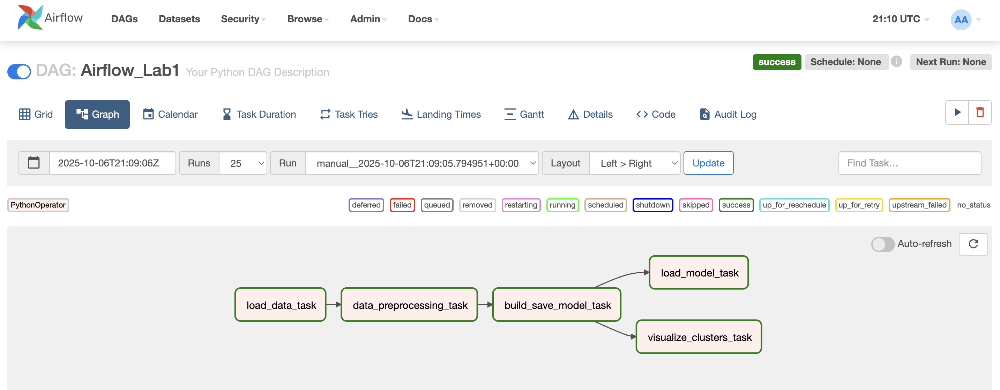
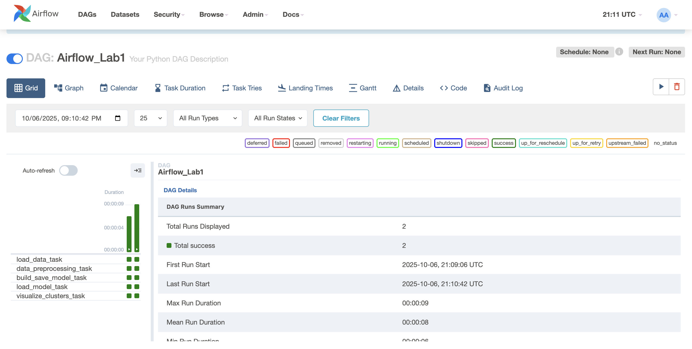
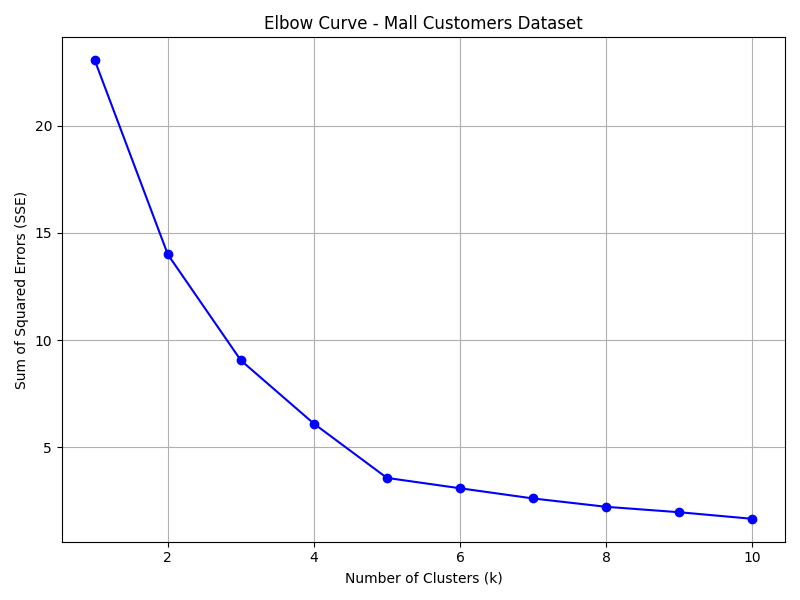
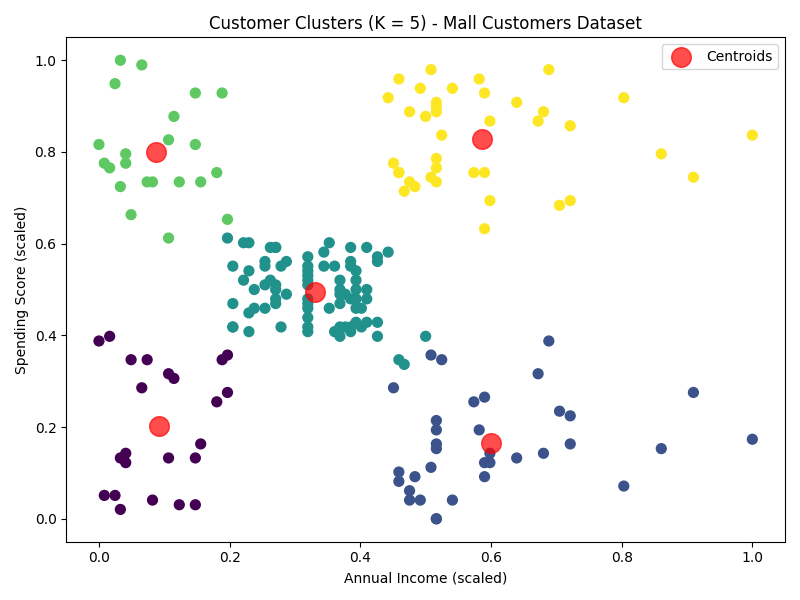

# Airflow lab

## Submission Changes

- Used Mall_Customers dataset instead of CC_General dataset.
- Created an additional function visualize_clusters().
- Attached docker image (screenshot) below.

- Attached graph_view image (screenshot) below.

- Attached grid_view image (screenshot) below.

- Attached elbow_curve image (screenshot) below.

- Attached cluster_plot image (screenshot) below.


---
- In order to install Airflow using docker you can watch our [Airflow Lab1 Tutorial Video](https://youtu.be/exFSeGUbn4Q?feature=shared)
- For latest step-by-step instructions, check out this blog - [AirFlow Lab-1](https://www.mlwithramin.com/blog/airflow-lab1)
---

### ML Model

This script is designed for data clustering using K-Means clustering and determining the optimal number of clusters using the elbow method. It provides functionality to load data from a CSV file, perform data preprocessing, build and save a K-Means clustering model, and determine the number of clusters based on the elbow method.

#### Prerequisites

Before using this script, make sure you have the following libraries installed:

- pandas
- scikit-learn (sklearn)
- kneed
- pickle
- matplotlib

#### Usage

You can use this script to perform K-Means clustering on your dataset as follows:

```python
# Load the data
data = load_data()

# Preprocess the data
preprocessed_data = data_preprocessing(data)

# Build and save the clustering model
sse_values = build_save_model(preprocessed_data, 'clustering_model.pkl')

# Load the saved model and determine the number of clusters
result = load_model_elbow('clustering_model.pkl', sse_values)
print(result)
```

#### Functions

1. **load_data():**
   - *Description:* Loads data from a CSV file, serializes it, and returns the serialized data.
   - *Usage:*
     ```python
     data = load_data()
     ```

2. **data_preprocessing(data)**
   - *Description:* Deserializes data, performs data preprocessing, and returns serialized clustered data.
   - *Usage:*
     ```python
     preprocessed_data = data_preprocessing(data)
     ```

3. **build_save_model(data, filename)**
   - *Description:* Builds a K-Means clustering model, saves it to a file, and returns SSE values.
   - *Usage:*
     ```python
     sse_values = build_save_model(preprocessed_data, 'clustering_model.pkl')
     ```

4. **load_model_elbow(filename, sse)**
   - *Description:* Loads a saved K-Means clustering model and determines the number of clusters using the elbow method.
   - *Usage:*
     ```python
     result = load_model_elbow('clustering_model.pkl', sse_values)
     ```
5. **def visualize_clusters(filename)**
   - *Description:* Fits a KMeans model with 5 clusters, then plots and saves clusters with their centroids as a PNG image.
   - *Usage:*
     ```python
     result = visualize_clusters('clustering_model.pkl')
     ```

### Airflow Setup

Use Airflow to author workflows as directed acyclic graphs (DAGs) of tasks. The Airflow scheduler executes your tasks on an array of workers while following the specified dependencies.

References

-   Product - https://airflow.apache.org/
-   Documentation - https://airflow.apache.org/docs/
-   Github - https://github.com/apache/airflow

#### Installation

Prerequisites: You should allocate at least 4GB memory for the Docker Engine (ideally 8GB).

Local

-   Docker Desktop Running

Cloud

-   Linux VM
-   SSH Connection
-   Installed Docker Engine - [Install using the convenience script](https://docs.docker.com/engine/install/ubuntu/#install-using-the-convenience-script)

#### Tutorial

1. Create a new directory

    ```bash
    mkdir -p ~/app
    cd ~/app
    ```

2. Running Airflow in Docker - [Refer](https://airflow.apache.org/docs/apache-airflow/stable/howto/docker-compose/index.html#running-airflow-in-docker)

    a. You can check if you have enough memory by running this command

    ```bash
    docker run --rm "debian:bullseye-slim" bash -c 'numfmt --to iec $(echo $(($(getconf _PHYS_PAGES) * $(getconf PAGE_SIZE))))'
    ```

    b. Fetch [docker-compose.yaml](https://airflow.apache.org/docs/apache-airflow/2.5.1/docker-compose.yaml)

    ```bash
    curl -LfO 'https://airflow.apache.org/docs/apache-airflow/2.5.1/docker-compose.yaml'
    ```

    c. Setting the right Airflow user

    ```bash
    mkdir -p ./dags ./logs ./plugins ./working_data
    echo -e "AIRFLOW_UID=$(id -u)" > .env
    ```

    d. Update the following in docker-compose.yml

    ```bash
    # Donot load examples
    AIRFLOW__CORE__LOAD_EXAMPLES: 'false'

    # Additional python package
    _PIP_ADDITIONAL_REQUIREMENTS: ${_PIP_ADDITIONAL_REQUIREMENTS:- pandas scikit-learn kneed matplotlib }

    # Output dir
    - ${AIRFLOW_PROJ_DIR:-.}/working_data:/opt/airflow/working_data

    # Change default admin credentials
    _AIRFLOW_WWW_USER_USERNAME: ${_AIRFLOW_WWW_USER_USERNAME:-akshaj}
    _AIRFLOW_WWW_USER_PASSWORD: ${_AIRFLOW_WWW_USER_PASSWORD:-akshaj}
    ```

    e. Initialize the database

    ```bash
    docker compose up airflow-init
    ```

    f. Running Airflow

    ```bash
    docker compose up
    ```

    Wait until terminal outputs

    `app-airflow-webserver-1  | 127.0.0.1 - - [6/Oct/2025:09:34:29 +0000] "GET /health HTTP/1.1" 200 141 "-" "curl/7.74.0"`

    g. Enable port forwarding

    h. Visit `localhost:8080` login with credentials set on step `2.d`

3. Explore UI and add user `Security > List Users`

4. Create a python script [`dags/sandbox.py`](dags/sandbox.py)

    - BashOperator
    - PythonOperator
    - Task Dependencies
    - Params
    - Crontab schedules

    You can have n number of scripts inside dags dir

5. Stop docker containers

    ```bash
    docker compose down
    ```
### Airflow DAG Script

This Markdown file provides a detailed explanation of the Python script that defines an Airflow Directed Acyclic Graph (DAG) for a data processing and modeling workflow.

#### Script Overview

The script defines an Airflow DAG named `your_python_dag` that consists of several tasks. Each task represents a specific operation in a data processing and modeling workflow. The script imports necessary libraries, sets default arguments for the DAG, creates PythonOperators for each task, defines task dependencies, and provides command-line interaction with the DAG.

#### Importing Libraries

```python
# Import necessary libraries and modules
from airflow import DAG
from airflow.operators.python_operator import PythonOperator
from datetime import datetime, timedelta
from src.lab import load_data, data_preprocessing, build_save_model, load_model_elbow
from airflow import configuration as conf
```
The script starts by importing the required libraries and modules. Notable imports include the `DAG` and `PythonOperator` classes from the `airflow` package, datetime manipulation functions, and custom functions from the `src.lab` module.


#### Enable pickle support for XCom, allowing data to be passed between tasks
```python
conf.set('core', 'enable_xcom_pickling', 'True')
```

#### Define default arguments for your DAG
```python
default_args = {
    'owner': 'akshaj',
    'start_date': datetime(2023, 9, 17),
    'retries': 0,  # Number of retries in case of task failure
    'retry_delay': timedelta(minutes=5),  # Delay before retries
}
```
Default arguments for the DAG are specified in a dictionary named default_args. These arguments include the DAG owner's name, the start date, the number of retries, and the retry delay in case of task failure.

#### Create a DAG instance named 'Airflow_Lab1' with the defined default arguments
``` python 
dag = DAG(
    'Airflow_Lab1',
    default_args=default_args,
    description='Your Python DAG Description',
    schedule_interval=None,  # Set the schedule interval or use None for manual triggering
    catchup=False,
)
```
Here, the DAG object dag is created with the name 'your_python_dag' and the specified default arguments. The description provides a brief description of the DAG, and schedule_interval defines the execution schedule (in this case, it's set to None for manual triggering). catchup is set to False to prevent backfilling of missed runs.


#### Task to load data, calls the 'load_data' Python function
``` python 
load_data_task = PythonOperator(
    task_id='load_data_task',
    python_callable=load_data,
    dag=dag,
)
```

#### Task to perform data preprocessing, depends on 'load_data_task'
```python 
data_preprocessing_task = PythonOperator(
    task_id='data_preprocessing_task',
    python_callable=data_preprocessing,
    op_args=[load_data_task.output],
    dag=dag,
)
```
The 'data_preprocessing_task' depends on the 'load_data_task' and calls the data_preprocessing function, which is provided with the output of the 'load_data_task'.

#### Task to build and save a model, depends on 'data_preprocessing_task'
```python
build_save_model_task = PythonOperator(
    task_id='build_save_model_task',
    python_callable=build_save_model,
    op_args=[data_preprocessing_task.output, "model2.sav"],
    dag=dag,
)
```
The 'build_save_model_task' depends on the 'data_preprocessing_task' and calls the build_save_model function with the preprocessed data and saves the model as "model2.sav".

#### Task to load a model using the 'load_model_elbow' function, depends on 'build_save_model_task'
``` python
load_model_task = PythonOperator(
    task_id='load_model_task',
    python_callable=load_model_elbow,
    op_args=["model2.sav", build_save_model_task.output],
    dag=dag,
)
```
The 'load_model_task' depends on the 'build_save_model_task' and calls the load_model_elbow function to load the saved model and compute the elbow curve with SSE values.

#### Task to visualize clusters, depends on 'build_save_model_task'
``` python
visualize_clusters_task = PythonOperator(
    task_id='visualize_clusters_task',
    python_callable=visualize_clusters,
    op_args=["model2.sav"],
    dag=dag,
)
```
The 'visualize_clusters_task' depends on the 'build_save_model_task' and calls the visualize_clusters function to create visual representations of the K-means clustering results using the saved model.


#### Set task dependencies
```python
load_data_task >> data_preprocessing_task >> build_save_model_task >> load_model_task
build_save_model_task >> visualize_clusters_task
```
Task dependencies are defined using the >> operator. The main pipeline executes in sequence: 'load_data_task' -> 'data_preprocessing_task' -> 'build_save_model_task' -> 'load_model_task'. Additionally, 'visualize_clusters_task' runs in parallel after 'build_save_model_task' completes, creating a branching workflow where both 'load_model_task' and 'visualize_clusters_task' can execute simultaneously once the model is saved.

#### If this script is run directly, allow command-line interaction with the DAG
```python
if __name__ == "__main__":
    dag.cli()
```
- Lastly, the script allows for command-line interaction with the DAG. When the script is run directly, the dag.cli() function is called, providing the ability to trigger and manage the DAG from the command line.
- This script defines a comprehensive Airflow DAG for a data processing and modeling workflow, with clear task dependencies and default arguments.

### Running an Apache Airflow DAG Pipeline in Docker

This guide provides detailed steps to set up and run an Apache Airflow Directed Acyclic Graph (DAG) pipeline within a Docker container using Docker Compose. The pipeline is named "your_python_dag."

#### Prerequisites

- Docker: Make sure Docker is installed and running on your system.

#### Step 1: Directory Structure

Ensure your project has the following directory structure:

```plaintext
your_airflow_project/
├── dags/
│   ├── airflow.py     # Your DAG script
├── src/
│   ├── lab.py                # Data processing and modeling functions
├── data/                       # Directory for data (if needed)
├── docker-compose.yaml         # Docker Compose configuration
```

#### Step 2: Docker Compose Configuration
Create a docker-compose.yaml file in the project root directory. This file defines the services and configurations for running Airflow in a Docker container.

#### Step 3: Start the Docker containers by running the following command

```plaintext
docker compose up
```

Wait until you see the log message indicating that the Airflow webserver is running:

```plaintext
app-airflow-webserver-1 | 127.0.0.1 - - [6/Oct/2025:09:34:29 +0000] "GET /health HTTP/1.1" 200 141 "-" "curl/7.74.0"
```

#### Step 4: Access Airflow Web Interface
- Open a web browser and navigate to http://localhost:8080.

- Log in with the credentials set in the .env file or use the default credentials (username: admin, password: admin).

- Once logged in, you'll be on the Airflow web interface.

#### Step 5: Trigger the DAG
- In the Airflow web interface, navigate to the "DAGs" page.

- You should see the "your_python_dag" listed.

- To manually trigger the DAG, click on the "Trigger DAG" button or enable the DAG by toggling the switch to the "On" position.

- Monitor the progress of the DAG in the Airflow web interface. You can view logs, task status, and task execution details.

#### Step 6: Pipeline Outputs

- Once the DAG completes its execution, check any output or artifacts produced by your functions and tasks. 
