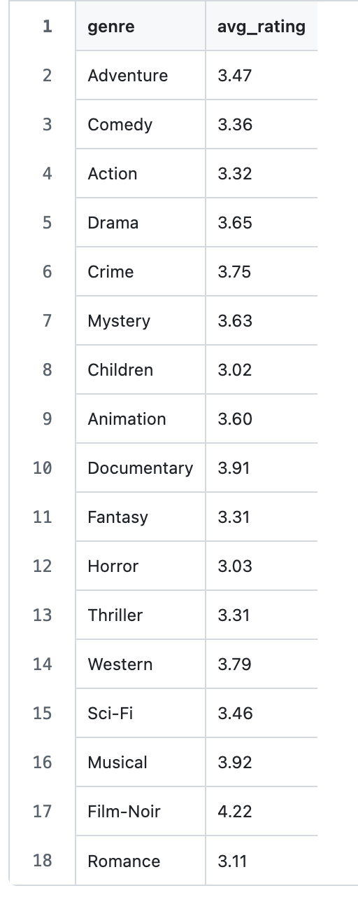
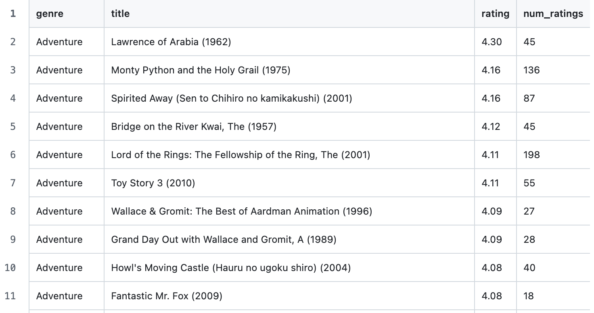
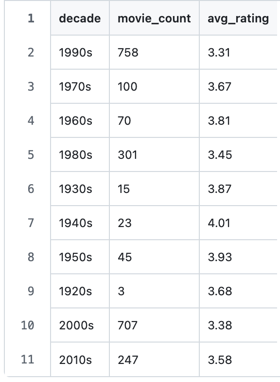
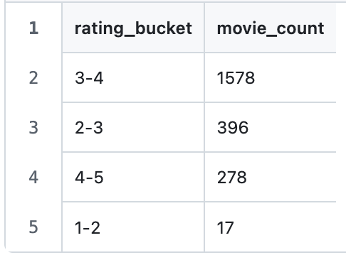
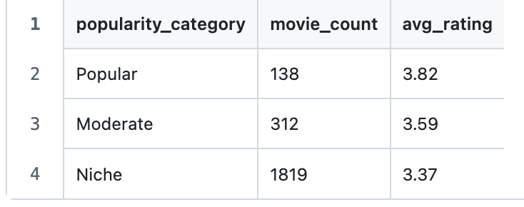

# MovieLens Data Pipeline with Apache Beam

A comprehensive ETL pipeline built with Apache Beam to analyze movie ratings data from the MovieLens dataset. This project demonstrates data processing, joining, aggregation and analytical reporting using Apache Beam's DirectRunner.

##  Overview

This project implements a scalable data pipeline using Apache Beam to process and analyze the MovieLens dataset. The pipeline reads movie and rating data, performs data cleaning and enrichment, joins datasets and generates five analytical reports providing insights into movie ratings, genres and popularity trends.

### Key Capabilities:
- **Data Ingestion**: Reads CSV files from local filesystem or Google Cloud Storage
- **Data Cleaning**: Filters invalid entries, extracts metadata from titles
- **Data Joining**: Combines movies with ratings using Apache Beam's CoGroupByKey
- **Aggregations**: Calculates averages, counts and top-N rankings
- **Multiple Outputs**: Generates 5 different analytical CSV reports
- **Scalable**: Runs locally with DirectRunner or on Google Cloud with DataflowRunner


## 📁 File Structure

```
movielens-beam-pipeline/
│
├── README.md                          
├── movie_pipeline.ipynb               # Jupyter notebook
├── requirements.txt                   # Python dependencies
├── .gitignore                         # Git ignore file
│
├── data/                              # Input data directory
│   ├── movies.csv                     # MovieLens movies dataset
│   └── ratings.csv                    # MovieLens ratings dataset
│
├── outputs/                           # Pipeline output directory
│   ├── genre_avg_rating-00000-of-00001.csv
│   ├── top10_movies_by_genre-00000-of-00001.csv
│   ├── decade_statistics-00000-of-00001.csv
│   ├── rating_distribution-00000-of-00001.csv
│   └── popularity_analysis-00000-of-00001.csv
│
├── screenshots/                       # Documentation screenshots
    ├── genre_avg_rating.png
    ├── top10_movies_by_genre.png
    ├── decade_statistics.png
    ├── rating_distribution.png
    └── popularity_analysis.png
```

### Key Files:

#### `movie_pipeline.ipynb`
The main Jupyter notebook containing:
- **Setup cells**: Installation and dataset download
- **Helper functions**: Safe type conversions and CSV formatting
- **DoFn classes**: ParseCSV, PreprocessMovies, JoinWithRatings
- **Pipeline definition**: Complete Apache Beam pipeline

#### `requirements.txt`
```
apache-beam==2.50.0
pandas==2.0.0
numpy==1.24.0
```

## Installation

### Prerequisites
- Python 3.8 or higher
- pip package manager

### Step 1: Clone the Repository
```bash
git clone https://github.com/Akshaj-N/MLOps_Labs.git
cd Lab3_Apache_Beam
```

### Step 2: Create Virtual Environment
```bash
python3 -m venv beam_env
source beam_env/bin/activate
```

### Step 3: Install Dependencies
```bash
pip install -r requirements.txt
```

### Step 4: Download Dataset
Manually download the dataset:
```bash
mkdir -p data
curl -L https://files.grouplens.org/datasets/movielens/ml-latest-small.zip -o ml-small.zip
unzip ml-small.zip
mv ml-latest-small/movies.csv data/
mv ml-latest-small/ratings.csv data/
rm -rf ml-latest-small ml-small.zip
```

## Usage

### Run Jupyter Notebook
```bash
jupyter notebook movie_pipeline.ipynb
```
## Pipeline Outputs

The pipeline generates 5 analytical CSV files:

### 1. Genre Average Rating (`genre_avg_rating-00000-of-00001.csv`)
**Purpose**: Shows average rating for each genre



**Use Case**: Identify which genres receive highest ratings

---

### 2. Top-N Movies by Genre (`top10_movies_by_genre-00000-of-00001.csv`)
**Purpose**: Lists top-rated movies in each genre



**Use Case**: Discover best movies per genre, filter by minimum ratings

---

### 3. Decade Statistics (`decade_statistics-00000-of-00001.csv`)
**Purpose**: Movie production and rating trends by decade



**Use Case**: Analyze historical trends in movie production and quality

---

### 4. Rating Distribution (`rating_distribution-00000-of-00001.csv`)
**Purpose**: Distribution of movies across rating buckets



**Use Case**: Understand rating distribution and identify outliers

---

### 5. Popularity Analysis (`popularity_analysis-00000-of-00001.csv`)
**Purpose**: Compares popular vs niche movies



**Use Case**: Analyze relationship between popularity and quality
