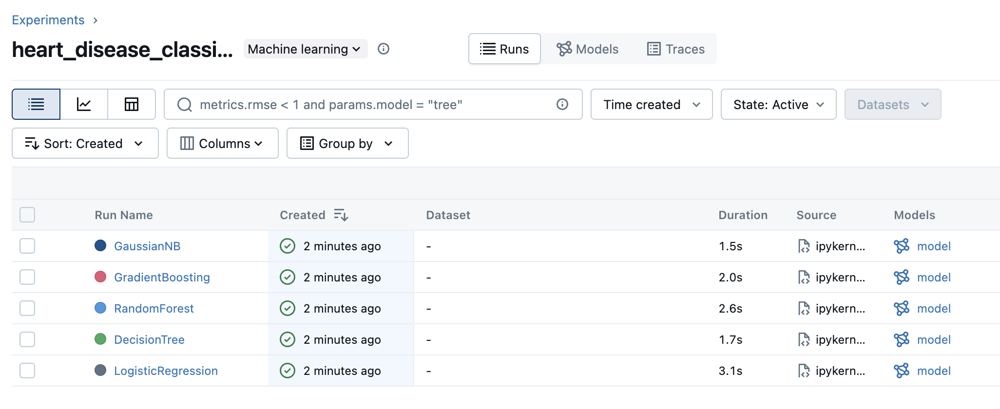
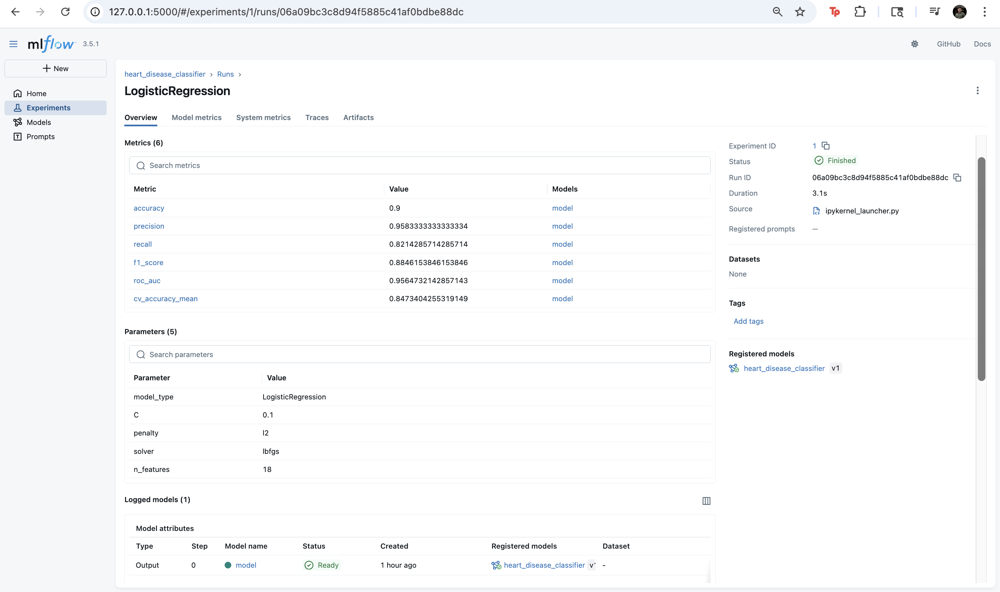
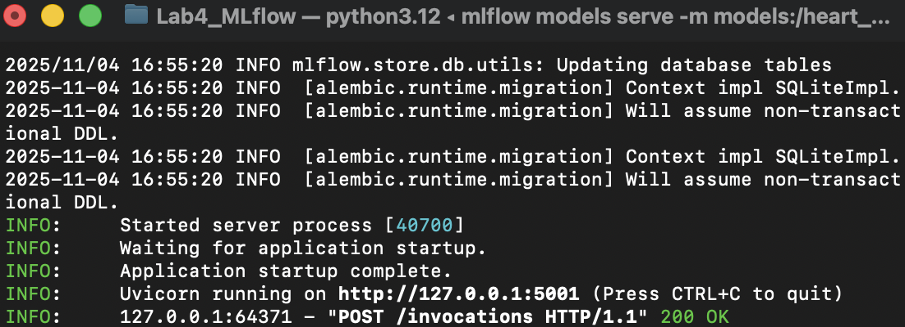
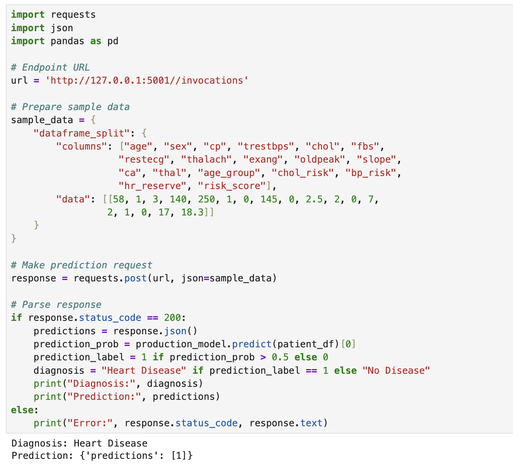
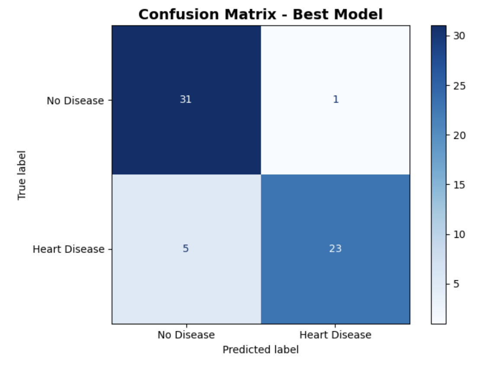

# Heart Disease Prediction with MLflow

A complete end-to-end MLOps pipeline using MLflow for heart disease classification using the UCI Heart Disease dataset.

## Overview

This project implements multiple classification algorithms to predict heart disease presence, tracks experiments using MLflow and deploys the best-performing model to production. The system achieves 90% accuracy with Logistic Regression as the top performer.

## Features

- **Multiple ML Models**: Logistic Regression, Decision Tree, Random Forest, Gradient Boosting, Gaussian Naive Bayes
- **MLflow Integration**: Complete experiment tracking, model registry and version management
- **Feature Engineering**: Custom health risk indicators and composite scores
- **Model Deployment**: Production-ready model serving with REST API
- **Comprehensive Evaluation**: Cross-validation, ROC-AUC, confusion matrices and detailed metrics

## Dataset

**Source**: UCI Machine Learning Repository - Cleveland Heart Disease Database

**Features** (13 original + 5 engineered):
- Clinical measurements: age, blood pressure, cholesterol, heart rate
- Medical indicators: chest pain type, ECG results, exercise-induced angina
- Engineered features: age groups, risk scores, cholesterol/BP risk flags

**Target**: Binary classification (0: No Disease, 1: Heart Disease Present)

**Samples**: 297 patients after preprocessing (46.13% disease prevalence)

## Installation

```bash
# Clone the repository
git clone https://github.com/Akshaj-N/MLOps_Labs.git
cd Lab4_MLflow

# Install dependencies
pip install pandas numpy mlflow scikit-learn matplotlib seaborn requests
```

## Project Structure

```
Lab4_MLflow/
├── mlflow.db                    # MLflow tracking database
├── mlruns/                      # MLflow artifacts and runs
├── heart_disease_mlflow.ipynb   # Main notebook
├── model_client.py              # API client script
└── README.md
```

## Usage

### 1. Run the Complete Pipeline

Open and execute the Jupyter notebook:

```bash
jupyter notebook heart_disease_mlflow.ipynb
```

The notebook performs:
- Data loading and preprocessing
- Feature engineering
- Training 5 different models
- MLflow experiment tracking
- Model evaluation and comparison
- Best model registration and deployment

### 2. View MLflow UI

```bash
mlflow ui --backend-store-uri sqlite:///mlflow.db
```

Navigate to `http://localhost:5000` to explore experiments, compare models and view metrics.

### 3. Serve the Production Model

```bash
mlflow models serve -m "models:/heart_disease_classifier/production" -p 5001 --no-conda
```

### 4. Make Predictions

Run the client script:

```bash
python3 model_client.py
```

Or use the REST API directly:

```python
import requests

url = 'http://127.0.0.1:5001/invocations'
sample_data = {
    "dataframe_split": {
        "columns": ["age", "sex", "cp", "trestbps", "chol", "fbs",
                    "restecg", "thalach", "exang", "oldpeak", "slope",
                    "ca", "thal", "age_group", "chol_risk", "bp_risk",
                    "hr_reserve", "risk_score"],
        "data": [[58, 1, 3, 140, 250, 1, 0, 145, 0, 2.5, 2, 0, 7,
                  2, 1, 0, 17, 18.3]]
    }
}

response = requests.post(url, json=sample_data)
print(response.json())
```

## Submission

### 1. Model Registry in MLflow


### 2. 5 models in MLflow 



### 3. MLflow metric tracking for Logistic Regression 



### 4. Serving the model for real-time inference



### 5. Real-Time Inference with the Deployed model



### 6. Confusion Matrix for the best model


