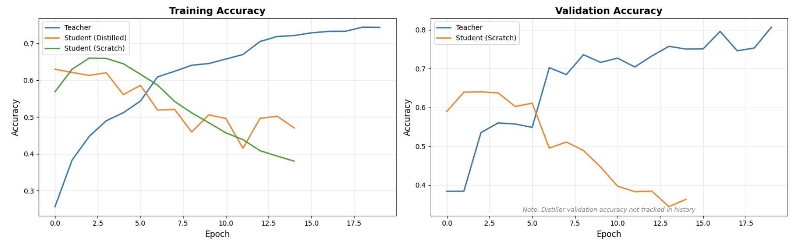
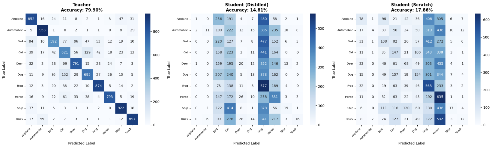
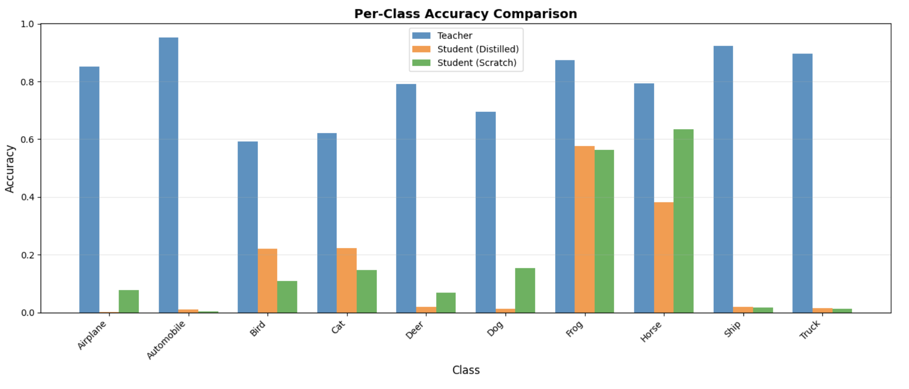

# Knowledge Distillation on CIFAR-10

A comprehensive implementation of **Knowledge Distillation** for image classification using TensorFlow/Keras. This project demonstrates how a smaller "student" model can learn from a larger "teacher" model to achieve better performance than training from scratch.

## Overview

Knowledge distillation is a model compression technique where a smaller model (student) learns to mimic a larger, more complex model (teacher). This project implements knowledge distillation on the CIFAR-10 dataset and compares three models:

1. **Teacher Model**: Large CNN with regularization (~1.5M parameters)
2. **Student (Distilled)**: Small CNN trained with knowledge distillation (~150K parameters)
3. **Student (Baseline)**: Same small CNN trained from scratch


## Key Features

- **Custom Distiller Class**: Implements knowledge distillation with temperature scaling
- **Comprehensive Analysis**: Per-class accuracy, confusion matrices, overfitting analysis
- **Rich Visualizations**: Training curves, comparison charts and performance metrics
- **Production Ready**: Clean, modular and well-documented code
- **Model Persistence**: Save and load trained models

---

## Dataset

**CIFAR-10** consists of 60,000 32x32 color images in 10 classes:

| Class | Examples |
|-------|----------|
| Airplane | 6,000 |
| Automobile | 6,000 |
| Bird | 6,000 |
| Cat | 6,000 |
| Deer | 6,000 |
| Dog | 6,000 |
| Frog | 6,000 |
| Horse | 6,000 |
| Ship | 6,000 |
| Truck | 6,000 |

**Split:**
- Training: 40,000 images (80%)
- Validation: 10,000 images (20%)
- Test: 10,000 images

## Requirements
```
tensorflow>=2.19.0
numpy>=1.24.0
pandas>=2.0.0
matplotlib>=3.7.0
seaborn>=0.12.0
scikit-learn>=1.3.0
```

## Installation

1. Clone this repository:
```bash
git clone https://github.com/Akshaj-N/MLOps_Labs.git
cd Lab6_Knowledge_Distillation
```

2. Install dependencies:
```bash
pip install -r requirements.txt
```

3. Run the Jupyter notebook:
```bash
jupyter notebook knowledge_distillation.ipynb
```

## Project Structure
```
knowledge-distillation-cifar10/
│
├── knowledge_distillation.ipynb    # Main implementation notebook
├── teacher_model.h5                # Trained teacher model
├── student_distilled.h5           # Distilled student model
├── student_scratch.h5             # Student trained from scratch
├── README.md                      # This file
└── requirements.txt               # Python dependencies
```

## Usage

### Training the Models

The notebook is organized into clear sections:

1. **Data Loading and Preparation**: Loads CIFAR-10 and splits into train/validation/test sets
2. **Model Architecture**: Defines teacher (large CNN) and student (small CNN) architectures
3. **Teacher Training**: Trains the teacher model to high accuracy
4. **Knowledge Distillation**: Trains student using soft targets from teacher
5. **Baseline Training**: Trains student from scratch for comparison
6. **Evaluation**: Comprehensive analysis and visualization

### Running Inference
```python
# Load a saved model
from tensorflow import keras

student = keras.models.load_model('student_distilled.h5')

# Make predictions
predictions = student.predict(test_images)
```

## Results

### Model Comparison

| Model | Parameters | Test Accuracy | Size Reduction |
|-------|-----------|---------------|----------------|
| Teacher | 3,249,098 | 78.64% | - |
| Student (Distilled) | 545,098 | 46.76% | 83.2% |
| Student (Scratch) | 545,098 | 36.87% | 83.2% |

### Key Findings

- **Compression Ratio**: 5.96x smaller model
- **Improvement from Distillation**: 9.89% better than training from scratch
- **Efficiency**: Significant parameter reduction while maintaining reasonable performance

## Key Concepts

### Knowledge Distillation

Knowledge distillation transfers knowledge from a large model (teacher) to a smaller model (student) through:

1. **Soft Targets**: The teacher's probability distributions contain more information than hard labels
2. **Temperature Scaling**: Softens the probability distribution to reveal inter-class relationships
3. **Combined Loss**: Balances learning from both soft targets (teacher) and hard labels (ground truth)

### Loss Function
```
L = α * L_hard + (1-α) * L_soft
```

Where:
- `L_hard`: Cross-entropy with true labels
- `L_soft`: KL divergence with teacher's predictions
- `α`: Balance parameter (0.1 in this implementation)
- `Temperature`: Softening parameter (5 in this implementation)

## Model Architecture

### Teacher Model (Large CNN)
- 3 convolutional blocks with BatchNormalization and Dropout
- Progressively increasing filters: 64 → 128 → 256
- Dense layer with 512 units
- Total parameters: 3,249,098

### Student Model (Small CNN)
- 2 convolutional blocks
- Filters: 32 → 64
- Dense layer with 128 units
- Total parameters: 545,098

## Visualizations

### 1. Training Curves

- Compares training and validation accuracy across all models
- Shows distilled student's improved generalization

### 2. Confusion Matrices

- Visualizes prediction patterns for each model
- Reveals which classes are commonly confused

### 3. Per-Class Accuracy

- Breakdown of performance by class
- Identifies where distillation helps most


